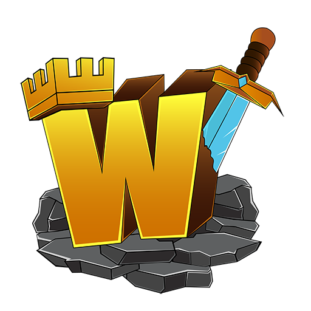

    
    <h1 style="margin-top: 25px; font-size:30px;">Winzoria</h1>

## Technologies utilisées

Ce site web est construit avec les technologies suivantes :

- Next.js
- React
- Drizzle ORM
- Tailwind CSS
- TypeScript
- Shadcn/ui

## À propos du serveur

Winzoria est un serveur Minecraft axé sur le PvP Faction. Nous nous efforçons de fournir une expérience de jeu équitable, où les achats en jeu n'offrent pas d'avantages compétitifs. Rejoignez-nous pour une expérience de jeu unique et passionnante.

## Licence

Le code source de ce site web n'est pas destiné à être réutilisé. Pour plus d'informations, veuillez contacter le propriétaire.

## Copyright

© [Cempack](https://elliotmoreau.fr). Tous droits réservés.
